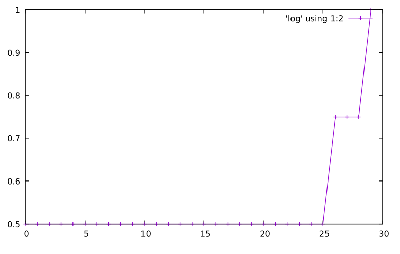

EvoNet
======

Neural Nets training with Vanilla Genetic Search demonstrated on the XOR problem.


The network tries to optimize the ROC-AUC metric. It does not require differentiation.


Install dependencies
------------------


```bash
pipenv install
```

Demo
----

```bash
pipenv shell
python nn.py > log
gnuplot

gnuplot> plot 'log' using 1:2 with linespoints
```


Sample Learning Plot
-------------------


